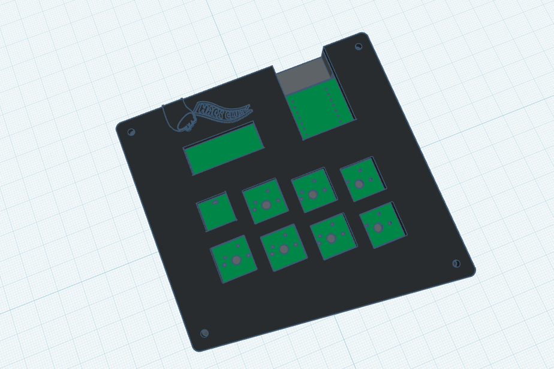
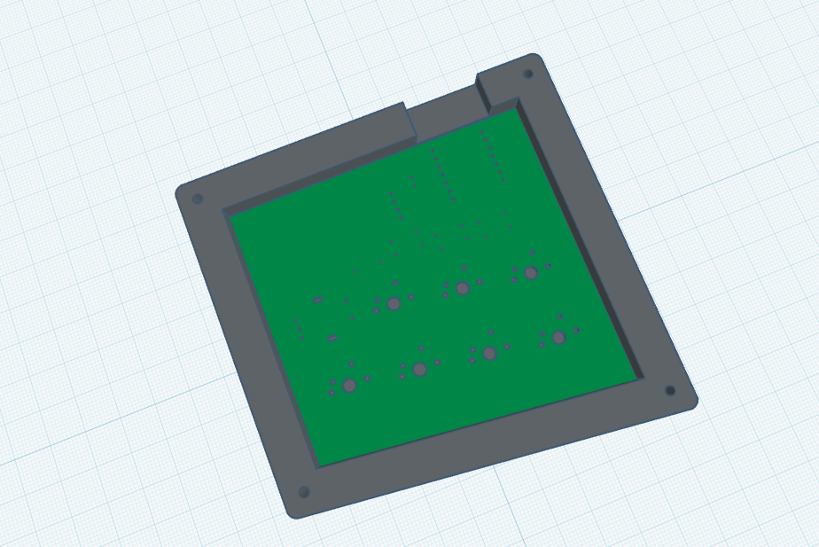
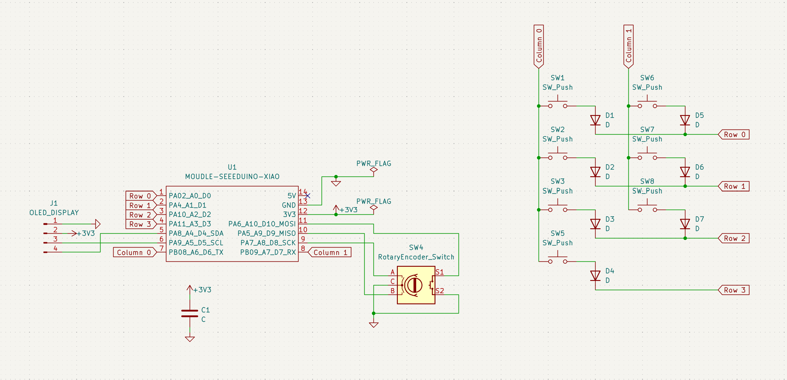
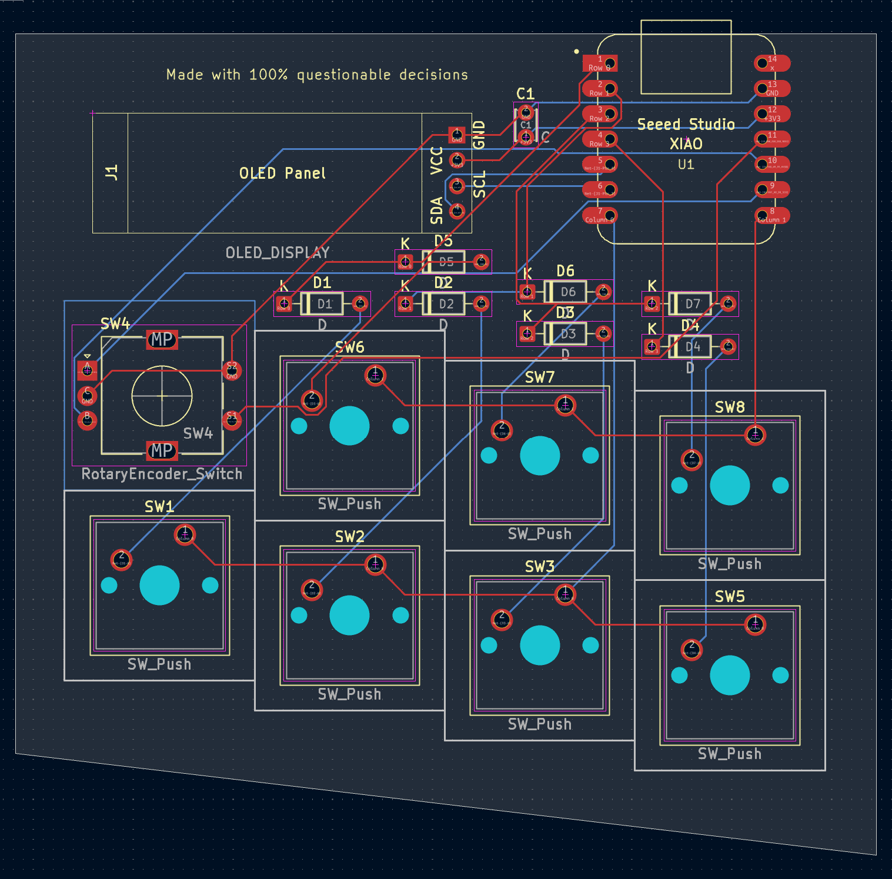
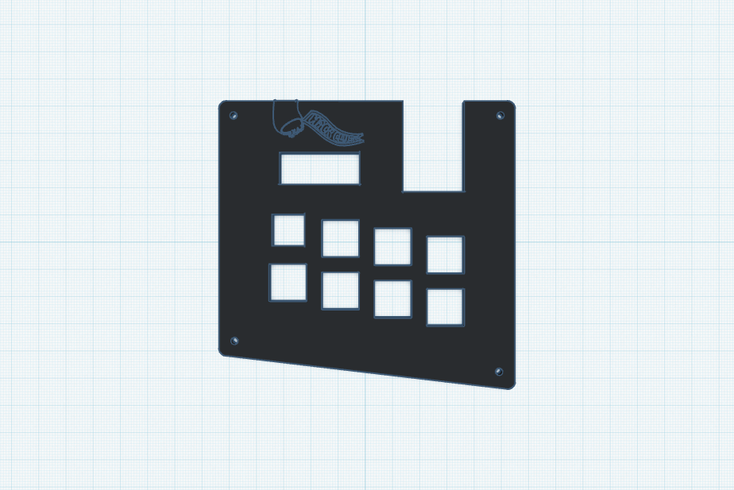
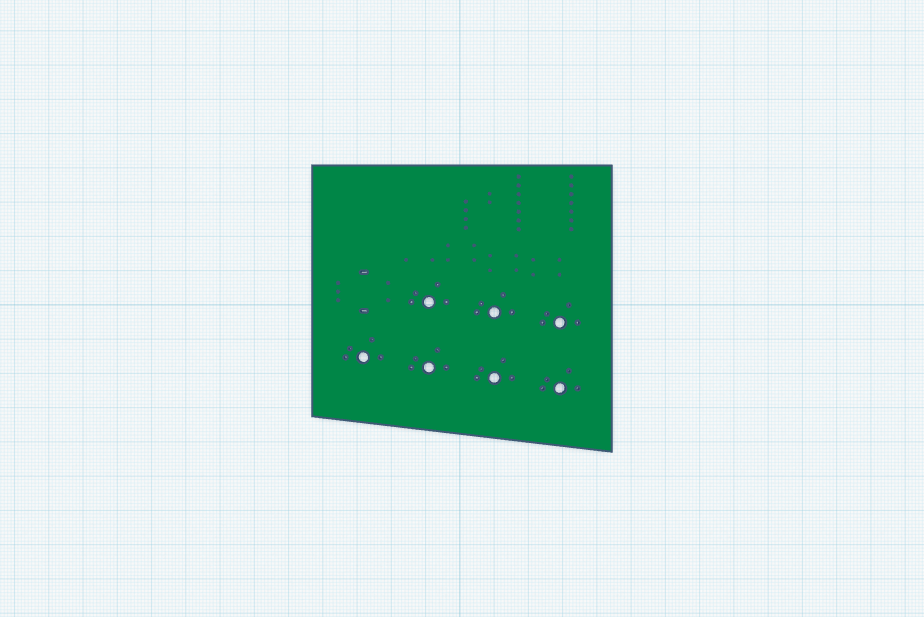
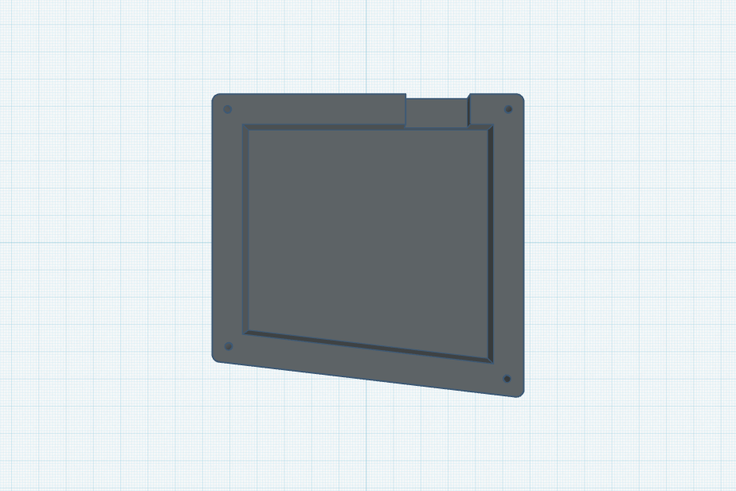

# Naman's Hackpad
The Hackpad has 8-inputs (7 switches + rotary encoder) with an OLED display. It uses [QMK](https://qmk.fm/) firmware, and the layout includes simple and frequently used shortcuts. 
<table align="center">
  <tr>
    <td></td>
    <td></td>
  </tr>
</table>

## PCB:
<table align="center">
  <tr>
    <td align="center"><strong>Schematic</strong></td>
    <td align="center"><strong>PCB</strong></td>
  </tr>
  <tr>
    <td></td>
    <td></td>
  </tr>
</table>

  <strong>Made in KiCad</strong>

## Case:
The case has two pieces, which includes the top switch plate and a bottom container. Inside it is a cavity where the PCB sits. The design also has a distinct diagonal edge on the bottom.

<table align="center">
  <tr>
    <td></td>
    <td align="center"><strong>Top Case</strong></td>
  </tr>
  <tr>
    <td></td>
    <td align="center"><strong>PCB Case</strong></td>
  </tr>
  <tr>
    <td></td>
    <td align="center"><strong>Bottom Case</strong></td>
  </tr>
</table>

  <strong>Made in Tinkercad</strong>

## Firmware
This Hackpad runs QMK firmware. There's a single layer with 7 keys mapped to the following shortcuts: new tab, new window, undo, redo, refresh, paste, and copy, with the encoder controlling volume. The OLED currently displays a simple status message.

## Final result:
This was the first PCB and CAD project I've ever finished, and had many challenges. I redesigned the PCB layout three separate times trying to get it under the 100x100mm size limit. 
The case design also had hurdles as I mostly started out eyeballing every measurement by dragging shapes around in Tinkercad, which never quite lined up right. I redid the whole thing once I actually found the align tool and coordinate input fields.
Finally, setting up Ubuntu to get the firmware going was a whole separate issue, but overall I am proud of my journey and final product.

## BOM:
Here is everything you need to create this Hackpad:
| Component | Amount |
| :--- | :---: |
| **Seeed XIAO RP2040** | 1x |
| **MX-Style switches (Cherry MX 1.00u)** | 7x |
| **1N4148 Diodes** | 7x |
| **EC11 Rotary encoder** | 1x |
| **0.91 inch OLED display** | 1x |
| **DSA keycaps** | 7x |
| **100nF Ceramic capacitor** | 1x |
| **M3x16mm screw** | 4x |
| **Case** (2 printed parts) | 1x |
| **PCB** | 1x |
